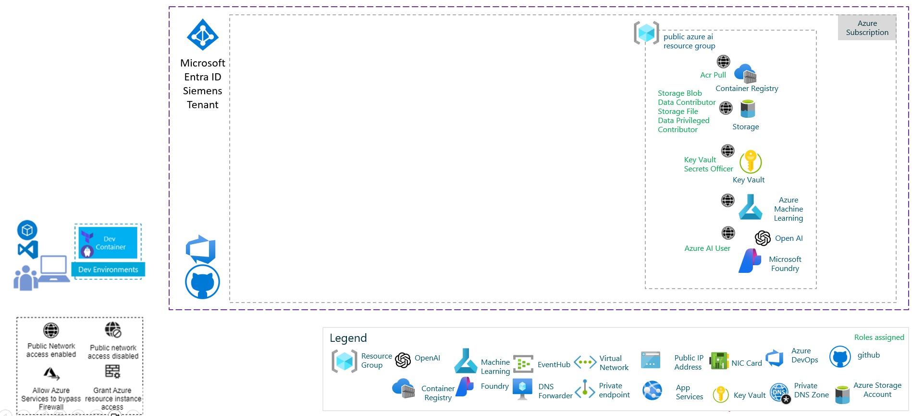
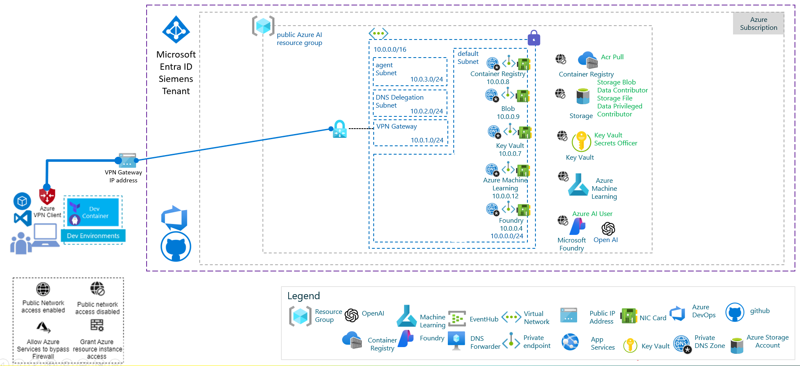
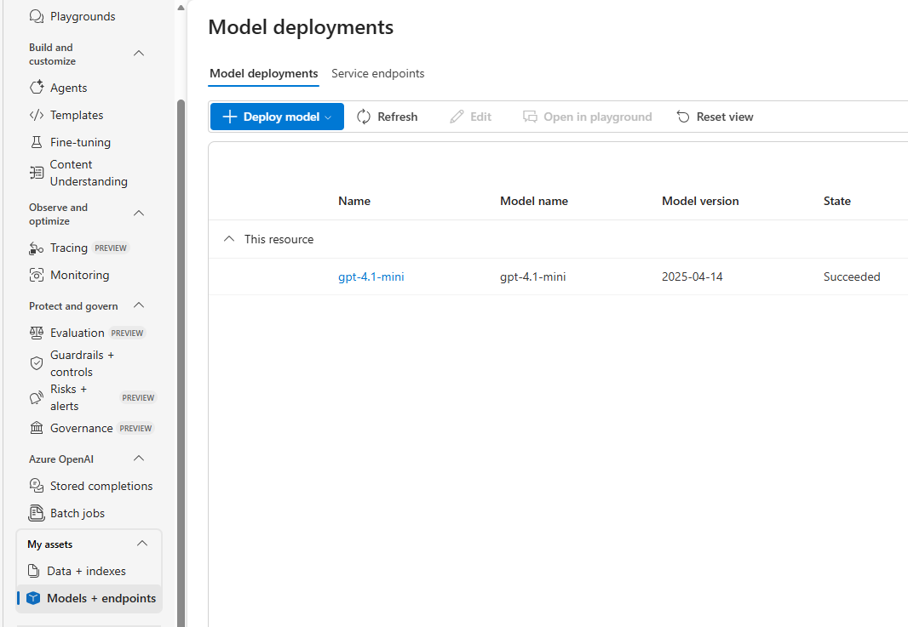
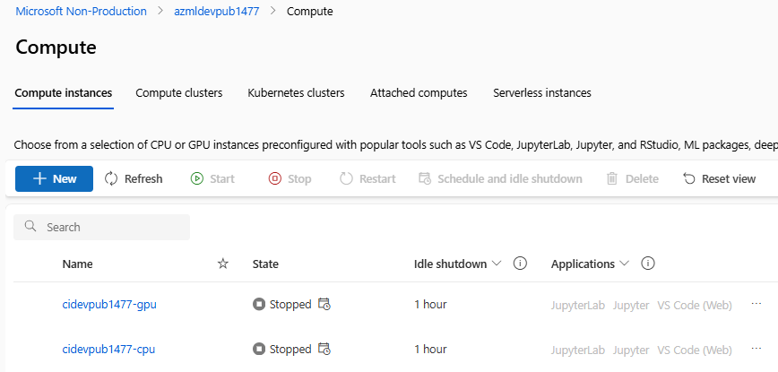
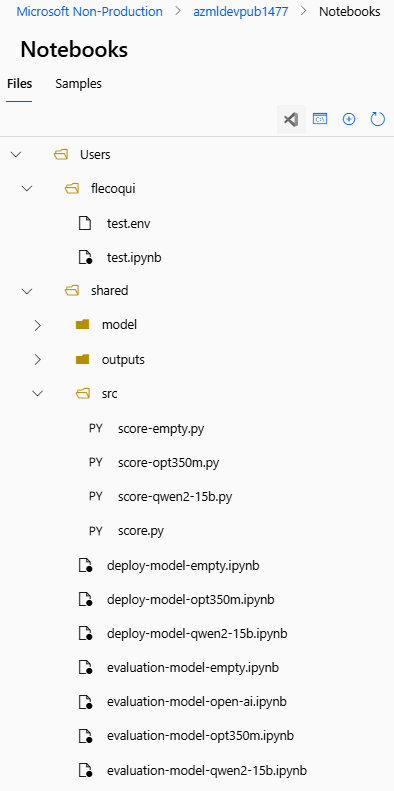
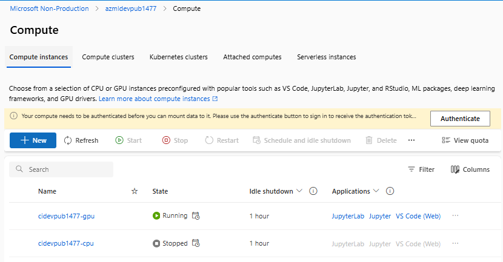

# Deploying Microsoft Foundry and Azure Machine Learning

## Introduction

This document describes how to deploy Microsoft Foundry and Azure Machine Learning with associated services (Azure Storage Account,Azure Key Vault, Azure Container Registry).

Once the infrastructure is deployed, you can :
- Deploy AI Model on Azure Machine Learning Endpoints
- Evaluate Content Safety of the new AI Model Endpoints using Red Team

Moreover, as it's an evaluation of the Azure Machine Learning and Microsoft Foundry infrastructure, it supports both configurations:
- One configuration with public endpoints to reach Foundry and Machine Learning.



- One configuration with private endpoints to reach Foundry and Machine Learning.




## Getting Started

In this repository, you'll find scripts and bicep files to deploy a Microsoft Foundry and Azure Machine Learning Infrastructure. This infrastructure will be deployed in the cloud (Azure)<>

This chapter describes how to :

1. Install the pre-requisites including Visual Studio Code, Dev Container
2. Create, deploy the infrastructure

This repository contains the following resources :

- A Dev container under '.devcontainer' folder
- The Azure configuration for a deployment under '.config' folder
- The scripts, bicep files and dataset files used to deploy the infrastructure under: ./infra

### Installing the pre-requisites

In order to test the solution, you need first an Azure Subscription, you can get further information about Azure Subscription [here](https://azure.microsoft.com/en-us/free).

You also need to install Git client and Visual Studio Code on your machine, below the links.

|[](https://git-scm.com/download/win) |[](https://git-scm.com/download/linux)|[](https://git-scm.com/download/mac)|
|:---|:---|:---|
| [Git Client for Windows](https://git-scm.com/download/win) | [Git client for Linux](https://git-scm.com/download/linux)| [Git Client for MacOs](https://git-scm.com/download/mac) |
[Visual Studio Code for Windows](https://code.visualstudio.com/Download)  | [Visual Studio Code for Linux](https://code.visualstudio.com/Download)  &nbsp;| [Visual Studio Code for MacOS](https://code.visualstudio.com/Download) &nbsp; &nbsp;|

Once the Git client is installed you can clone the repository on your machine running the following commands:

1. Create a Git directory on your machine

    ```bash
        c:\> mkdir git
        c:\> cd git
        c:\git>
    ```

2. Clone the repository.
    For instance:

    ```bash
        c:\git> git clone  https://github.com/flecoqui/azure-ai-automated.git
        c:\git> cd ./azure-ai-automated
        c:\git\azure-ai-automated>
    ```

### Using Dev Container

#### Installing Dev Container pre-requisites

You need to install the following pre-requisite on your machine

1. Install and configure [Docker](https://www.docker.com/get-started) for your operating system.

   - Windows / macOS:

     1. Install [Docker Desktop](https://www.docker.com/products/docker-desktop) for Windows/Mac.

     2. Right-click on the Docker task bar item, select Settings / Preferences and update Resources > File Sharing with any locations your source code is kept. See [tips and tricks](https://code.visualstudio.com/docs/remote/troubleshooting#_container-tips) for troubleshooting.

     3. If you are using WSL 2 on Windows, to enable the [Windows WSL 2 back-end](https://docs.docker.com/docker-for-windows/wsl/): Right-click on the Docker taskbar item and select Settings. Check Use the WSL 2 based engine and verify your distribution is enabled under Resources > WSL Integration.

   - Linux:

     1. Follow the official install [instructions for Docker CE/EE for your distribution](https://docs.docker.com/get-docker/). If you are using Docker Compose, follow the [Docker Compose directions](https://docs.docker.com/compose/install/) as well.

     2. Add your user to the docker group by using a terminal to run: 'sudo usermod -aG docker $USER'

     3. Sign out and back in again so your changes take effect.

2. Ensure [Visual Studio Code](https://code.visualstudio.com/) is already installed.

3. Install the [Remote Development extension pack](https://marketplace.visualstudio.com/items?itemName=ms-vscode-remote.vscode-remote-extensionpack)

#### Using Visual Studio Code and Dev Container

1. Launch Visual Studio Code in the folder where you cloned the 'ps-data-foundation-imv' repository

    ```bash
        c:\git\dataops> code .
    ```

2. Once Visual Studio Code is launched, you should see the following dialog box:

    

3. Click on the button 'Reopen in Container'
4. Visual Studio Code opens the Dev Container. If it's the first time you open the project in container mode, it first builds the container, it can take several minutes to build the new container.
5. Once the container is loaded, you can open a new terminal (Terminal -> New Terminal).
6. And from the terminal, you have access to the tools installed in the Dev Container like az client,....

    ```bash
        vscode ➜ /workspaces/azure-ai-automated (main) $ az login
    ```

### How to deploy infrastructure from the Dev Container terminal

The Dev Container is now running, you can use the bash file [./infra/deploy-infra.sh ](./infra/infra/deploy-infra.sh ) to:

- deploy the infrastructure 
- create data copy pipeline

Below the list of arguments associated with 'deploy-infra.sh ':

- -a  Sets action {azure-login, deploy-public-azure-ai, deploy-public-datasource, remove-public-azure-ai, remove-public-datasource, deploy-private-azure-ai, deploy-private-datasource, remove-private-azure-ai, remove-private-datasource,}
- -c  Sets the configuration file
- -e  Sets environment dev, staging, test, preprod, prod
- -t  Sets deployment Azure Tenant Id
- -s  Sets deployment Azure Subscription Id
- -r  Sets the Azure Region for the deployment

#### Connection to Azure

Follow the steps below to establish with your Azure Subscription where you want to deploy your infrastructure.

1. Launch the Azure login process using 'deploy-infra.sh -a azure-login'.
Usually this step is not required in a pipeline as the connection with Azure is already established.

    ```bash
        vscode ➜ /workspaces/azure-ai-automated (main) $ ./infra/deploy-infra.sh   -a azure-login
    ```

    After this step the default Azure subscription has been selected. You can still change the Azure subscription, using Azure CLI command below:

    ```bash
        vscode ➜ /workspaces/azure-ai-automated (main) $ az account set --subscription <azure-subscription-id>
    ```
    Using the command below you can define the Azure region, subscription, the tenant and the environment where Microsoft Foundry and Azure Machine Learning will be deployed.

    ```bash
        vscode ➜ /workspaces/azure-ai-automated (main) $ ./infra/deploy-infra.sh -a azure-login -r <azure_region> -e dev -s <subscription_id> -t <tenant_id>
    ```

    After this step, the variables AZURE_REGION, AZURE_SUBSCRIPTION_ID, AZURE_TENANT_ID and AZURE_ENVIRONMENT used for the deployment are stored in the file ./.config/.default.env.
    The variable AZURE_DEFAULT_AZURE_AI_RESOURCE_GROUP is by default empty string.
    By default the name of the Microsoft Foundry and Azure Machine Learning resource group will be 'rgpurview[AZURE_ENVIRONMENT][visibility][AZURE_SUFFIX]'
    the name of the Datasource resource group will be 'rgdatasource[AZURE_ENVIRONMENT][visibility][AZURE_SUFFIX]'
    where [visibility] value is 'pri' for private deployment and 'pub' for public deployment.

    ```bash
        vscode ➜ /workspaces/azure-ai-automated (main) $ cat ./.config/.default.env
        AZURE_REGION=westus3
        AZURE_SUFFIX=to-be-updated (4 digits)
        AZURE_SUBSCRIPTION_ID=to-be-updated
        AZURE_TENANT_ID=to-be-updated
        AZURE_ENVIRONMENT=dev
        AZURE_DEFAULT_AZURE_AI_RESOURCE_GROUP=""
    ```

    In order to deploy the infrastructure with the script 'deploy-infra.sh ', you need to be connected to Azure with sufficient privileges to assign roles to Azure Key Vault and Azure Storage Accounts.
    Instead of using an interactive authentication session with Azure using your Azure account, you can use a service principal connection.

    If you don't have enough permission to create the resource groups for this deployment and you must reuse existing resource groups, you can set the value AZURE_DEFAULT_AZURE_AI_RESOURCE_GROUP in file ./.config/.default.env.

    For instance:

    ```bash
        AZURE_DEFAULT_AZURE_AI_RESOURCE_GROUP="foundry-test-rg"
    ```

    If you don't have enough permission to deploy some resources in your subscription and you must reuse existing resources like Microsoft Foundry and Azure Machine Learning, you can change the file [naming-convention.bicep](./bicep/naming-convention.bicep) to set the name of some resources.

    For instance:
    ```bash
        @description('The Azure Environment (dev, staging, preprod, prod,...)')
        @maxLength(13)
        param environment string = uniqueString(resourceGroup().id)

        @description('The cloud visibility (pub, pri)')
        @maxLength(7)
        param visibility string = 'pub'

        @description('The Azure suffix')
        @maxLength(4)
        param suffix string = '0000'


        var baseName = toLower('${environment}${visibility}${suffix}')

        output azureMLName string = 'azml${baseName}'
        output azureMLComputeInstanceName string = 'ci${baseName}'
        output azureMLComputeGPUSize string = 'Standard_NC4as_T4_v3'
        output azureMLComputeCPUSize string = 'Standard_DS11_v2'
        output foundryName string = 'foundry${baseName}'
        output foundryProjectName string = 'foundryproject${baseName}'
        output acrName string = 'acr${baseName}'
        output appInsightsName string = 'appi${baseName}'
        output vnetName string = 'vnet${baseName}'
        output storageAccountName string = 'st${baseName}'
        output storageAccountDefaultContainerName string = 'test${baseName}'
        output keyVaultName string = 'kv${baseName}'
        output privateEndpointSubnetName string = 'snet${baseName}pe'
        output datagwSubnetName string = 'snet${baseName}dtgw'
        output vpnGatewayName string = 'vnetvpngateway${baseName}'
        output vpnGatewayPublicIpName string = 'vnetvpngatewaypip${baseName}'
        output dnsResolverName string = 'vnetdnsresolver${baseName}'
        output bastionSubnetName string = 'AzureBastionSubnet'
        output bastionHostName string = 'bastion${baseName}'
        output bastionPublicIpName string = 'bastionpip${baseName}'
        output gatewaySubnetName string = 'GatewaySubnet'
        output dnsDelegationSubNetName string = 'DNSDelegationSubnet'
        output baseName string = baseName
        output resourceGroupAzureAIName string = 'rgazureai${baseName}'
    ```

#### Deploying Microsoft Foundry and Azure Machine Learning with public endpoint

1. Once you are connected to your Azure subscription, you can now deploy a Microsoft Foundry and Azure Machine Learning infrastructure associated with public endpoints.

    ```bash
        vscode ➜ /workspaces/azure-ai-automated (main) $ ./infra/deploy-infra.sh   -a deploy-public-azure-ai
    ```

    After this step, the variables AZURE_SUFFIX and PURVIEW_PRINCIPAL_ID used for the deployment are stored in the file ./.config/.default.env.
    AZURE_SUFFIX is used to name the Azure resource. For a public endpoint deployement with suffix will be "${AZURE_ENVIRONMENT}pub${AZURE_SUFFIX}", and "${AZURE_ENVIRONMENT}pri${AZURE_SUFFIX}" for a deployment with private endpoints
   

    ```bash
        vscode ➜ /workspaces/azure-ai-automated (main) $ cat ./.config/.default.env
        AZURE_REGION=westus3
        AZURE_SUBSCRIPTION_ID=to-be-completed
        AZURE_TENANT_ID=to-be-completed
        AZURE_ENVIRONMENT=dev
        AZURE_SUFFIX=3033
    ```

    AZURE_REGION defines the Azure region where you want to install your infrastructure, it's 'westus3' by default.
    AZURE_SUFFIX defines the suffix which is used to name the Azure resources. By default this suffix includes 4 random digits which are used to avoid naming conflict when a resource with the same name has already been deployed in another subscription.
    AZURE_SUBSCRIPTION_ID is the Azure Subscription Id where you want to install your infrastructure
    AZURE_TENANT_ID is the Azure Tenant Id used for the authentication.
    AZURE_ENVIRONMENT defines the environment 'dev', 'stag', 'prod',...


2. Once Microsoft Foundry and Azure Machine Learning are deployed into your Azure subscription, you can check whether all the associated resources are deployed. 

3. In the Azure Portal, select Microsoft Foundry Project resource whose name starts with foundryproject. On the Overview tab, click on the 'Go to Foundry portal' button to open the Microsoft Foundry portal. Click on the tab 'Models + endpoints'. You should see the 'gpt-4.1-mini' deployed on Microsoft Foundry.

    

4. In the Azure Portal, select Azure Machine Learning Workspace resource whose name starts with 'azml'. On the Overview tab, click on the 'Launch Studio' button to open the Machine Learning portal. Click on the tab 'Compute'. You should see 2 compute instances deployed, one CPU based (Standard_DS11_v2) and another one GPU based (Standard_NC4as_T4_v3).

    

5. Click on the tab 'Notebooks', you should see the following notebooks under 'Users\shared':
    - deploy-model-empty.ipynb: Notebook to deploy a model which always send the same response (used to capture the requests coming from the evaluation pipeline or notebooks)
    - deploy-model-opt350m.ipynb: Notebook to deploy the model Opt350m from Hugging Face 
    - deploy-model-qwen2-15b.ipynb: Notebook to deploy the model Qwen2-1.5b from Hugging Face
    - deploy-model-smalllm.ipynb: Notebook to deploy the model SmolLM2-360M from Hugging Face, this model doesn't require a GPU compute instance, a CPU compute instance is sufficient to run the model
    - evaluation-model-empty.ipynb: Notebook to run safety evaluation of the empty model
    - evaluation-model-opt350m.ipynb: Notebook to run safety evaluation of the Opt350m model
    - evaluation-model-qwen2-15b.ipynb: Notebook to run safety evaluation of the Qwen2-1.5b model
    - evaluation-model-smalllm.ipynb: Notebook to run safety evaluation of the SmolLM2-360M model
    - evaluation-model-open-ai.ipynb: Notebook to run safety evaluation of the Open AI model ('gpt-4.1-mini') deployed in Microsoft Foundry.

    

    Beyond the notebooks, the scoring scripts are also copied under 'Users\shared\src':
    - score-empty.py: Scoring script used with empty model 
    - score-opt350m.py: Scoring script used with Opt350m model 
    - score-qwen2-15b.py: Scoring script used with Qwen2-1.5b model 
    - score-smalllm.py: Scoring script used with SmolLM2-360M model     

7. If you face any error when running the notebooks, check whether your Microsoft Entra ID token expired. In the Azure Portal, select Azure Machine Learning Workspace resource whose name starts with 'azml'. On the Overview tab, click on the 'Launch Studio' button to open the Machine Learning portal. Click on the tab 'Compute', click on the 'Authenticate' button, to renew your Microsoft Entra ID token. This token will be used to call most of the endpoints hosting the differents models.

    

8. When your tests are over, you can remove the infrastructure running the following commands:

    ```bash
        vscode ➜ /workspaces/azure-ai-automated (main) $ ./infra/deploy-infra.sh   -a remove-public-azure-ai
    ```


#### Deploying Microsoft Foundry and Azure Machine Learning with private endpoints

1. Once you are connected to your Azure subscription, you can now deploy a Microsoft Foundry and Azure Machine Learning infrastructure associated with private endpoints.

    ```bash
        vscode ➜ /workspaces/azure-ai-automated (main) $ ./infra/deploy-infra.sh   -a deploy-private-azure-ai
    ```

    After this step, the variables AZURE_SUFFIX and PURVIEW_PRINCIPAL_ID used for the deployment are stored in the file ./.config/.default.env.
    AZURE_SUFFIX is used to name the Azure resource. For a private endpoint deployement with suffix will be "${AZURE_ENVIRONMENT}pub${AZURE_SUFFIX}", and "${AZURE_ENVIRONMENT}pri${AZURE_SUFFIX}" for a deployment with private endpoints

    ```bash
        vscode ➜ /workspaces/azure-ai-automated (main) $ cat ./.config/.default.env
        AZURE_REGION=westus3
        AZURE_SUBSCRIPTION_ID=to-be-completed
        AZURE_TENANT_ID=to-be-completed
        AZURE_ENVIRONMENT=dev
        AZURE_SUFFIX=3033
    ```

    AZURE_REGION defines the Azure region where you want to install your infrastructure, it's 'westus3' by default.
    AZURE_SUFFIX defines the suffix which is used to name the Azure resources. By default this suffix includes 4 random digits which are used to avoid naming conflict when a resource with the same name has already been deployed in another subscription.
    AZURE_SUBSCRIPTION_ID is the Azure Subscription Id where you want to install your infrastructure
    AZURE_TENANT_ID is the Azure Tenant Id used for the authentication.
    AZURE_ENVIRONMENT defines the environment 'dev', 'stag', 'prod',...


2. Once Microsoft Foundry and Azure Machine Learning are deployed into your Azure subscription, as all the new resources are connected to a virtual network with public access disabled, you need to establish a VPN connection to this virtual network before running the notebooks.

3. As the Virtual Network is fully isolated, the VPN Gateway has been installed connected to the Virtual Network. You can now test this VPN Gateway.

4. Install Azure VPN Client on your machine. Windows version available [here](https://apps.microsoft.com/detail/9np355qt2sqb?hl=en-US&gl=US)

5. Open the [Azure portal](https://portal.azure.com), under the private Azure AI resource group find the `virtual network gateway` resource.

6. Open it, navigate to `Settings`, `Point-to-site configuration` and select `Download VPN client`.

7. Unzip the zip file on your machine.

8. Launch the Azure VPN Client and import the file: `azurevpnconfig.xml` file in `AzureVPN` folder into the Azure VPN Client.

9. Click on the 'Connect' button, you'll need to enter your tenant credentials to establish a connection with the virtual network.

10. Once you are connected through the VPN session, you'll have to copy the notebook files and scoring files on the Azure Storage and store the configuration in Azure Key Vault. As both the Azure Storage and Azure Key Vault are connected to the VNET, the VPN connection is mandatry for the subsequent steps.

11. You can now copy and configure the notebook files using the command below:

    ```bash
        vscode ➜ /workspaces/azure-ai-automated (main) $ ./infra/deploy-infra.sh   -a configure-private-azure-ai
    ```
    This command will fail if the VPN connection is not established. Using the dig command against the storage blob endpoint host, you can test whether the VPN connection is correctly coonfigured: the returned IP address is a private IP address and not a public IP address. below the command line:
    
    ```bash
        vscode ➜ /workspaces/azure-ai-automated (main) $ dig "${storage_account}.blob.core.windows.net"
    ```
    
12. Now the infrastructure if fully configured, you can open the Azure Machine Learning portal url https://ml.azure.com/, and check all the menus are accessible without any errors. 

13. Once Microsoft Foundry and Azure Machine Learning are deployed into your Azure subscription, you can check whether all the associated resources are deployed. 

14. In the Azure Portal, select Microsoft Foundry Project resource whose name starts with foundryproject. On the Overview tab, click on the 'Go to Foundry portal' button to open the Microsoft Foundry portal. Click on the tab 'Models + endpoints'. You should see the 'gpt-4.1-mini' deployed on Microsoft Foundry.

    

15. In the Azure Portal, select Azure Machine Learning Workspace resource whose name starts with 'azml'. On the Overview tab, click on the 'Launch Studio' button to open the Machine Learning portal. Click on the tab 'Compute'. You should see 2 compute instances deployed, one CPU based (Standard_DS11_v2) and another one GPU based (Standard_NC4as_T4_v3).

    

16. Click on the tab 'Notebooks', you should see the following notebooks under 'Users\shared':
    - deploy-model-empty.ipynb: Notebook to deploy a model which always send the same response (used to capture the requests coming from the evaluation pipeline or notebooks)
    - deploy-model-opt350m.ipynb: Notebook to deploy the model Opt350m from Hugging Face 
    - deploy-model-qwen2-15b.ipynb: Notebook to deploy the model Qwen2-1.5b from Hugging Face
    - deploy-model-smalllm.ipynb: Notebook to deploy the model SmolLM2-360M from Hugging Face, this model doesn't require a GPU compute instance, a CPU compute instance is sufficient to run the model
    - evaluation-model-empty.ipynb: Notebook to run safety evaluation of the empty model
    - evaluation-model-opt350m.ipynb: Notebook to run safety evaluation of the Opt350m model
    - evaluation-model-qwen2-15b.ipynb: Notebook to run safety evaluation of the Qwen2-1.5b model
    - evaluation-model-smalllm.ipynb: Notebook to run safety evaluation of the SmolLM2-360M model
    - evaluation-model-open-ai.ipynb: Notebook to run safety evaluation of the Open AI model ('gpt-4.1-mini') deployed in Microsoft Foundry.

    

    Beyond the notebooks, the scoring scripts are also copied under 'Users\shared\src':
    - score-empty.py: Scoring script used with empty model 
    - score-opt350m.py: Scoring script used with Opt350m model 
    - score-qwen2-15b.py: Scoring script used with Qwen2-1.5b model 
    - score-smalllm.py: Scoring script used with SmolLM2-360M model 

##### Removing the resources

1. When your tests are over, you can remove the infrastructure running the following commands:

    ```bash
        vscode ➜ /workspaces/azure-ai-automated (main) $ ./infra/deploy-infra.sh   -a remove-private-azure-ai
    ```
